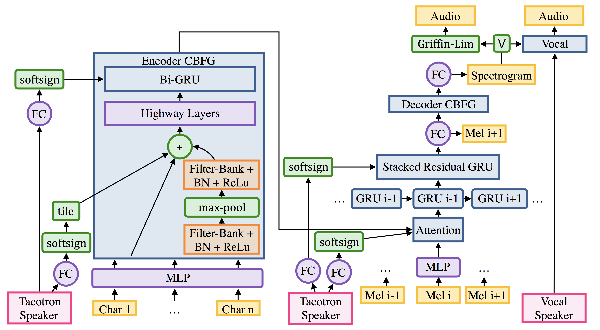

# D.Voice: 오픈소스 딥러닝 음성 합성 엔진

[[English Guide](./README.md)]

D.Voice는 TensorFlow로 구현된 오픈소스 딥러닝 음성 합성 엔진입니다. 이 프로젝트는:

- [Deep Voice 2: Multi-Speaker Neural Text-to-Speech](https://arxiv.org/abs/1705.08947)
- [Listening while Speaking: Speech Chain by Deep Learning](https://arxiv.org/abs/1707.04879)
- [Tacotron: Towards End-to-End Speech Synthesis](https://arxiv.org/abs/1703.10135)

위 세 논문의 모델들의 구현을 포함하고 있습니다. 음성 데모는 [여기](http://carpedm20.github.io/tacotron/)서 들어보실 수 있습니다.

## Prerequisites

- Python 3.6+
- [Tensorflow 1.3](https://www.tensorflow.org/install/)

## 사용 방법

### 1. 필수 라이브러리 설치

[Tensorflow 1.3](https://www.tensorflow.org/install/)를 설치한 후, 아래 명령어로 필수 라이브러리를 설치합니다.

    pip3 install -r requirements.txt

바로 음성을 만들고 싶으면 [2-3. 학습된 모델 다운받기](#2-3-미리-학습된-모델-다운받기)를 따라하시면 됩니다.

### 2-1. 학습할 데이터 준비하기

`datasets` 디렉토리는 다음과 같이 구성되어야 합니다:

    datasets
    ├── son
    │   ├── alignment.json
    │   └── audio
    │       ├── 1.mp3
    │       ├── 2.mp3
    │       ├── 3.mp3
    │       └── ...
    └── 아무개
        ├── alignment.json
        └── audio
            ├── 1.mp3
            ├── 2.mp3
            ├── 3.mp3
            └── ...

그리고 `아무개/alignment.json`는 아래와 같은 포멧으로 `json` 형태로 준비해 주세요.

    {
        "./datasets/아무개/audio/001.mp3": "존경하는 국민 여러분",
        "./datasets/아무개/audio/002.mp3": "국회의장과 국회의원 여러분",
        "./datasets/아무개/audio/003.mp3": "저는 오늘",
    }

`datasets`와 `아무개/alignment.json`가 준비되면, 아래 명령어로 학습 데이터를 만드시면 됩니다:

    python3 -m datasets.synthesizer_data ./datasets/아무개/alignment.json

### 2-2. {손석희, 문재인, 박근혜} 데이터 만들기

만약 음성 데이터가 없으시다면, 3명의 한국인 음성 데이터를 만드실 수 있습니다:

1. [손석희](https://ko.wikipedia.org/wiki/%EC%86%90%EC%84%9D%ED%9D%AC)
2. [박근혜](https://ko.wikipedia.org/wiki/%EB%B0%95%EA%B7%BC%ED%98%9C)
3. [문재인](https://ko.wikipedia.org/wiki/%EB%AC%B8%EC%9E%AC%EC%9D%B8)

각각의 데이터는 아래 스크립트로 만들 수 있으며,

    ./scripts/prepare_son.sh # 손석희
    ./scripts/prepare_park.sh # 박근혜
    ./scripts/prepare_moon.sh # 문재인

각 스크립트는 아래와 같은 명령어를 실행합니다. (son 기준으로 설명합니다)

0. 자동으로 `음성<->텍스트` 페어를 만들기 위해 [구글 음성 인식 API](https://cloud.google.com/speech/)를 사용하며, `GOOGLE_APPLICATION_CREDENTIALS`를 준비해야 합니다. `GOOGLE_APPLICATION_CREDENTIALS`를 얻기 위해서는 [여기](https://developers.google.com/identity/protocols/application-default-credentials)를 참고해 주세요.

       export GOOGLE_APPLICATION_CREDENTIALS="YOUR-GOOGLE.CREDENTIALS.json"

1. 음성(혹은 영상)과 텍스트 데이터를 다운로드 받습니다.

       python -m datasets.son.download

2. 음성을 정적을 기준으로 분리합니다.

       python -m audio.silence --audio_pattern "./datasets/son/audio/*.wav" --method=pydub

3. 작게 분리된 음성들을 [Google Speech Recognition API](https://cloud.google.com/speech/)를 사용해 대략적인 문장들을 예측합니다. (`moon`과 `park` 데이터셋은 `recognition.json`이 이미 있기 때문에 이 과정은 생략하셔도 됩니다.) 

       python -m recognition.google --audio_pattern "./datasets/son/audio/*.*.wav"

4. 기존의 텍스트와 음성 인식으로 예측된 텍스트를 비교해 `음성<->텍스트` 쌍 정보를 `./datasets/son/alignment.json`에 저장합니다.

       python -m recognition.alignment --recognition_path "./datasets/son/recognition.json" --score_threshold=0.5

5. 마지막으로 학습에 사용될 numpy 파일들을 만듭니다.

       python3 -m datasets.generate_data ./datasets/son/alignment.json

자동화 과정이 굉장히 간단하기 때문에, 데이터에 노이즈가 많이 존재합니다. 하지만 오디오와 텍스트가 충분히 많이 있다면 (처음부터 학습시 20시간 이상, 미리 학습된 모델에서 학습시 5+시간 이상) 적당한 퀄리티의 음성 합성을 기대할 수 있습니다.

### 2-3. 미리 학습된 모델 다운받기

미리 학습된 모델들을 사용해 음성을 만들거나 모델을 학습시킬 수 있습니다. 아래 모델 중 하나를 다운로드 받으시고:

1. 단일 화자 모델 - [손석희](https://ko.wikipedia.org/wiki/%EC%86%90%EC%84%9D%ED%9D%AC)

       python3 download.py son

2. 단일 화자 모델 - [박근혜](https://ko.wikipedia.org/wiki/%EB%B0%95%EA%B7%BC%ED%98%9C)

       python3 download.py park

학습된 모델을 다운받으시고, 아래 명령어로 음성을 만들어 낼 수 있습니다:

    python3 synthesizer.py --load_path logs/son-20171015 --text "이거 실화냐?"
    python3 synthesizer.py --load_path logs/park-20171015 --text "이거 실화냐?"

**주의: 학습된 모델을 연구 이외의 목적으로 사용하는 것을 금지합니다.**

### 3. 모델 학습하기

단일 화자 모델을 학습하려면:

    python3 train.py --data_path=datasets/son
    python3 train.py --data_path=datasets/park --initialize_path logs/son-20171015

다중 화자 모델을 학습하려면:

    python3 train.py --data_path=datasets/son,datasets/park

학습 데이터가 좋지 않다면 `--initialize_path`로 이미 학습된 모델의 파라미터로 초기화 해서 학습하시는 것이 좋습니다.

### 4. 음성 만들기

모델을 학습시킨 후 웹 데모를 통해 음성을 만들거나:

    python app.py --load_path logs/park-20171015 --num_speakers=1

아래 명령어로 음성을 만들 수 있습니다:

    python3 synthesizer.py --load_path logs/park-20171015 --text "이거 실화냐?"

## Disclaimer

이것은 [데브시스터즈](http://devsisters.com/)의 공식적인 제품이 아닙니다. [데브시스터즈](http://devsisters.com/)는 이 코드를 잘못 사용했을 시 발생한 문제나 이슈에 대한 책임을 지지 않으며 이 소프트웨어의 사용은 사용자 자신에게 전적으로 책임이 있습니다.

## References

- [Keith Ito](https://github.com/keithito)'s [tacotron](https://github.com/keithito/tacotron)
- [DEVIEW 2017 발표 자료](https://www.slideshare.net/carpedm20/deview-2017-80824162)

## Author

Taehoon Kim / [@carpedm20](http://carpedm20.github.io/)
